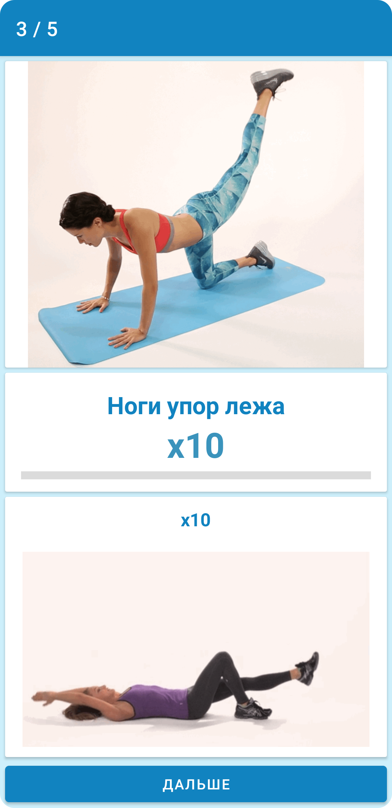

# FitnessApp
Приложение для занятий спортом по программе.

## Возможности приложения
* Выбор дней тренировок.
* Анимированные упражнения.
* Возможность расширения программы при дальнейшей разработке до 1 месяца и по количеству упражнений.
* Отслеживание пройденных упражнений.
* Отслеживания прогресса по дням.
* Возможность сброса всех дней.

## Технологический стек
* MVVM
* SplashScreen
* Fragments
* Viewbinding
* ActionBar

## Минимальные требования
* Поддержка Android 5.0+
* Поддержка смартфонов
* Поддержка портретной ориентации
* Приложение должно быть реализовано с рекомендациями Material Design
* targetSdk=30 или выше
* Kotlin

## Скриншоты
 
 
 
 
 
 
 

